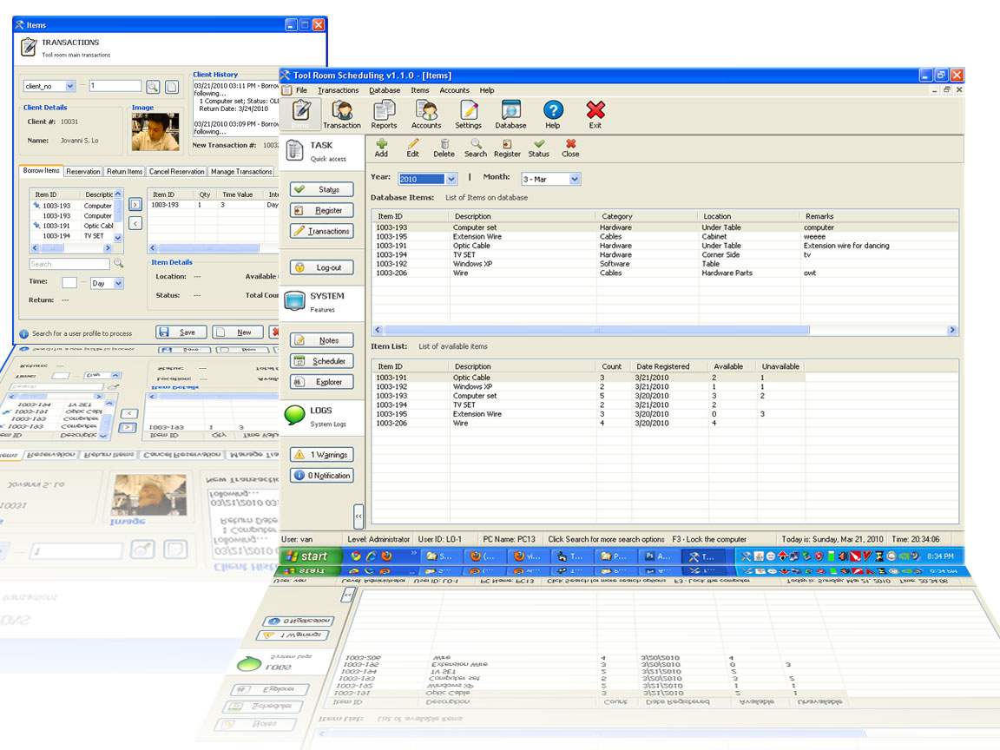



## Advance Scheduling System

### Description

Scheduling System. Complete. Some codes from my Advance POS.. ^^. This system includes components that are needed to run the system. PSC did not include those components on my .Zip file. Download the components here. http://www.fileden.com/files/2006/9/5/203867/Components.zip . Hope u like it.
 
### More Info
 

             |
---                |---
**Submitted On**   |2010-03-21 20:53:02
**By**             |[Jovanni Lo](https://github.com/Planet-Source-Code/PSCIndex/blob/master/ByAuthor/jovanni-lo.md)
**Level**          |Advanced
**User Rating**    |4.2 (21 globes from 5 users)
**Compatibility**  |VB 6\.0
**Category**       |[Databases/ Data Access/ DAO/ ADO](https://github.com/Planet-Source-Code/PSCIndex/blob/master/ByCategory/databases-data-access-dao-ado__1-6.md)
**World**          |[Visual Basic](https://github.com/Planet-Source-Code/PSCIndex/blob/master/ByWorld/visual-basic.md)
**Archive File**   |[Advance\_Sc2177563212010\.zip](https://github.com/Planet-Source-Code/jovanni-lo-advance-scheduling-system__1-73019/archive/master.zip)

